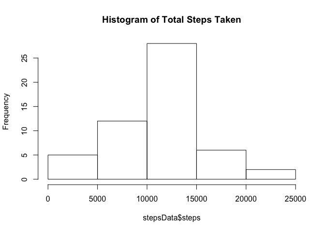
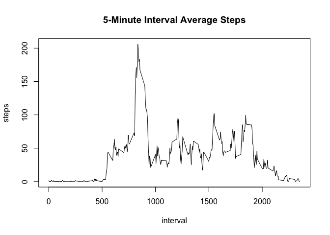
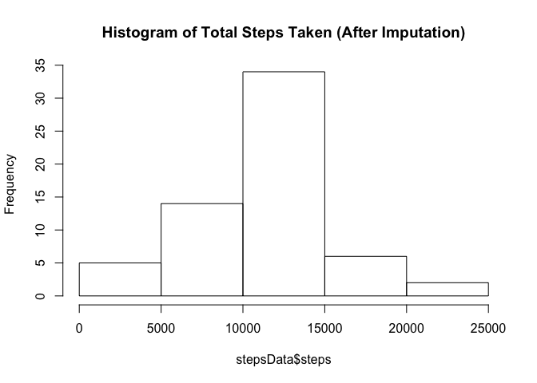
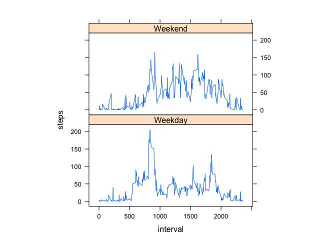

# Reproducible Research: Peer Assessment 1


## Loading and preprocessing the data


The data comes in a single csv file after unzipping, which is easy to read. 


```r
unzip("activity.zip")
activityData <- read.csv("activity.csv")
```

In prepration for imputing the data at a later stage, I will leave the data unprocessed and simply process it before each requirement. 


## What is mean total number of steps taken per day?


Calculate the mean and median.


```r
# Keep only relevant data, group by date, remove NA values
stepsData <- aggregate(steps~date, data = activityData, sum, na.rm = TRUE)

# find mean 
mean(stepsData$steps)
```

```
## [1] 10766.19
```

```r
#find median
median(stepsData$steps)
```

```
## [1] 10765
```

We find that the mean is equal to approximately <strong>10766</strong>, and the median is equal to <strong>10765</strong>. We will create a histogram to display this data visually.


```r
hist(stepsData$steps, main = paste("Histogram of Total Steps Taken"))
```

<!-- -->


## What is the average daily activity pattern?

In order to calculate this, we will transform the data once more, but this time replacing date with intervals, and using mean instead of sum in order to get the average across all days.


```r
# Keep only relevant data, group by date, remove NA values
intervalsData <- aggregate(steps~interval, data = activityData, mean, na.rm = TRUE)

# creating a time series plot
plot(steps ~ interval, data = intervalsData, type = "l", main = "5-Minute Interval Average Steps")
```

<!-- -->

We can visually see that the maximum number of steps lie between the 500 and 1000 intervals, but let's calculate it.


```r
maxInterval <- intervalsData$interval[which.max(intervalsData$steps)]
maxValue <- intervalsData$steps[which.max(intervalsData$steps)]
```

The exact interval lies at <strong>835</strong>, and the maximum is <strong>206.1698113</strong> steps.


## Imputing missing values

Calculate and report the total number of missing values in the dataset (i.e. the total number of rows with NAs). In order to do that, we will use the raw activityData.


```r
sum(!complete.cases(activityData))
```

```
## [1] 2304
```

We have <strong>2304</strong> rows with missing data, out of 17568 rows.

I will be using the mice package in order to impute the data, so make sure you have it installed before loading it.


```r
library(mice)
```

```
## Loading required package: Rcpp
```

```
## mice 2.25 2015-11-09
```

```r
#View the pattern of the missing data

md.pattern(activityData)
```

```
##       date interval steps     
## 15264    1        1     1    0
##  2304    1        1     0    1
##          0        0  2304 2304
```

We immediately notice that we only have missing values in the steps column, and none in the interval and date column, which definitely makes our job easier. The process of imputation takes about a minute. 


```r
tempData <- mice(activityData, m=5, maxit = 10, printflag = TRUE)
```

```
## 
##  iter imp variable
##   1   1  steps
##   1   2  steps
##   1   3  steps
##   1   4  steps
##   1   5  steps
##   2   1  steps
##   2   2  steps
##   2   3  steps
##   2   4  steps
##   2   5  steps
##   3   1  steps
##   3   2  steps
##   3   3  steps
##   3   4  steps
##   3   5  steps
##   4   1  steps
##   4   2  steps
##   4   3  steps
##   4   4  steps
##   4   5  steps
##   5   1  steps
##   5   2  steps
##   5   3  steps
##   5   4  steps
##   5   5  steps
##   6   1  steps
##   6   2  steps
##   6   3  steps
##   6   4  steps
##   6   5  steps
##   7   1  steps
##   7   2  steps
##   7   3  steps
##   7   4  steps
##   7   5  steps
##   8   1  steps
##   8   2  steps
##   8   3  steps
##   8   4  steps
##   8   5  steps
##   9   1  steps
##   9   2  steps
##   9   3  steps
##   9   4  steps
##   9   5  steps
##   10   1  steps
##   10   2  steps
##   10   3  steps
##   10   4  steps
##   10   5  steps
```

```r
completedData <- complete(tempData,1)
```

We repeat creating a histogram of the total number of steps taken each day, and the mean and median of the steps, to see if our imputation was correct.


```r
# Keep only relevant data, group by date, remove NA values
stepsData <- aggregate(steps~date, data = completedData, sum, na.rm = TRUE)

# find mean 
mean(stepsData$steps)
```

```
## [1] 10760.92
```

```r
#find median
median(stepsData$steps)
```

```
## [1] 10765
```

```r
hist(stepsData$steps, main = paste("Histogram of Total Steps Taken (After Imputation)"))
```

<!-- -->

We find that the results are very similar, therefore our imputation did not skew the data too much.


## Are there differences in activity patterns between weekdays and weekends?

Create a new factor variable in the dataset with two levels – “weekday” and “weekend” indicating whether a given date is a weekday or weekend day. We will need to use the chron library for this.


```r
library(chron)
completedData$Week = chron::is.weekend(completedData$date)
completedData$Week <- as.character(completedData$Week)

completedData$Week[completedData$Week == "TRUE"] <- "Weekend"
completedData$Week[completedData$Week == "FALSE"] <- "Weekday"
completedData$Week <- as.factor(completedData$Week)
```

After we have the dates classified into weekdays and weekends, we can plot the data. I'm going to be using the lattice library.


```r
library(lattice)
WeekData <- aggregate(steps ~ interval + Week, completedData, mean)
xyplot(steps ~ interval | factor(Week), data = WeekData, aspect = 1/2, type = "l")
```

<!-- -->


## End  
